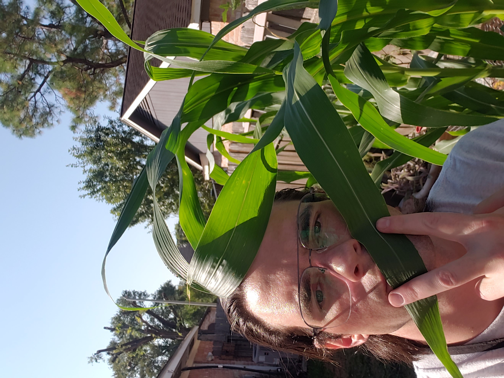

# 🥗 Word Salad

> _"Freedom Two is the freedom to help your neighbor by distributing copies of the program. Now, for beings that can think and learn, sharing useful knowledge is a fundamental act of friendship. When these beings use computers, this act of friendship takes the form of sharing software. Friends share with each other. Friends help each other. This is the nature of friendship. And, in fact, this spirit of goodwill—the spirit of helping your neighbor, voluntarily—is society’s most important resource."_
>
> ***
>
> \
> **Citation**\
> Stallman, Richard. _Free Software, Free Society: Selected Essays of Richard M. Stallman_. GNU Project, 2002. [https://www.gnu.org/philosophy/fsfs/rms-essays.pdf](https://www.gnu.org/philosophy/fsfs/rms-essays.pdf).
>
> In-text citation: (Stallman 2002, 38)

## :notebook\_with\_decorative\_cover: What is this?

It is a collection of various Bashisms, one-liners, scriptlets, and general-purpose hacks that a former manager, colleague, person, et al. probably taught me.

In other words, these are my personal notes - [the ones I am not too embarrassed to share](#user-content-fn-1)[^1]. 


[cheatsheets](word-salad/cheatsheets/)



[lfd109x](word-salad/lfd109x/)



[lfs182x](word-salad/lfs182x/)



[lfs146x](word-salad/lfs146x/)



[lfs241x](word-salad/lfs241x/)


<figure><figcaption>
"Knowledge Gardens" are too complicated for my smooth brain; thus, I've opted for a literal garden to complement this knowledge base.
</figcaption></figure>

[^1]: This statement is subject to change.
