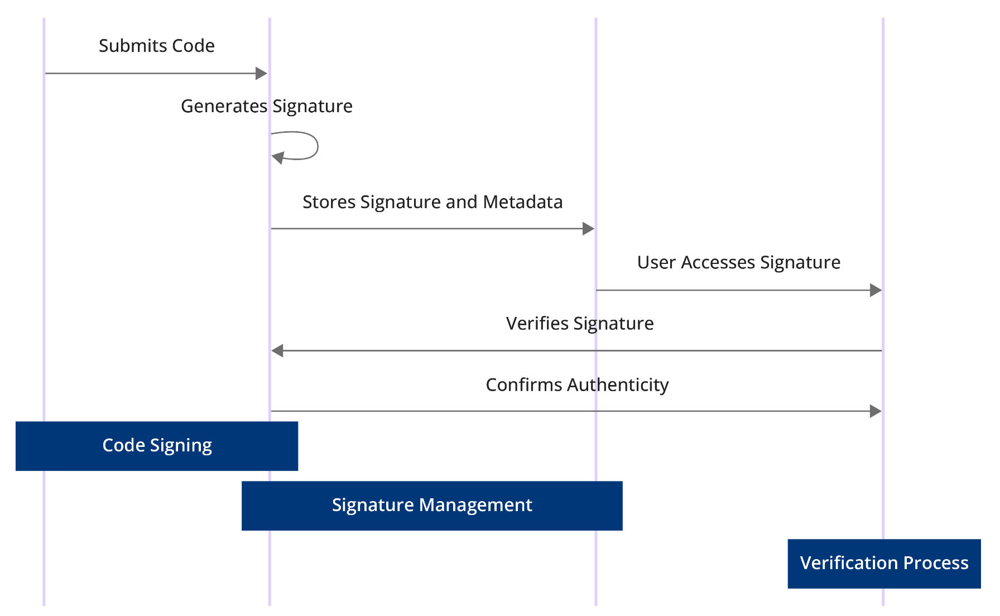

# Chains Explained

## Packet Flow

### Chains

RouterOS consists of a few default chains. These chains allow you to filter packets at various points:

* **PREROUTING** chain: Rules in this chain apply to packets as they just arrive on the network interface. This chain is present in the nat, mangle and raw tables. 
* **INPUT** chain: Rules in this chain apply to packets just before they’re given to a local process. This chain is present in the mangle and filter tables. 
* **OUTPUT** chain: The rules here apply to packets just after a process produces them. This chain is present in the raw, mangle, nat, and filter tables. 
* **FORWARD** chain: The rules here apply to any packets that are routed through the current host. This chain is only present in the mangle and filter tables.
* **POSTROUTING** chain: The rules in this chain apply to packets as they leave the network interface. It is present in the nat and mangle tables.

Each of the prerouting, input, forward, output, and postrouting blocks contains even more facilities, which are illustrated in the third part of the packet flow diagram:

<figure><figcaption>
Packet Flow Diagram - Chains
</figcaption></figure>
