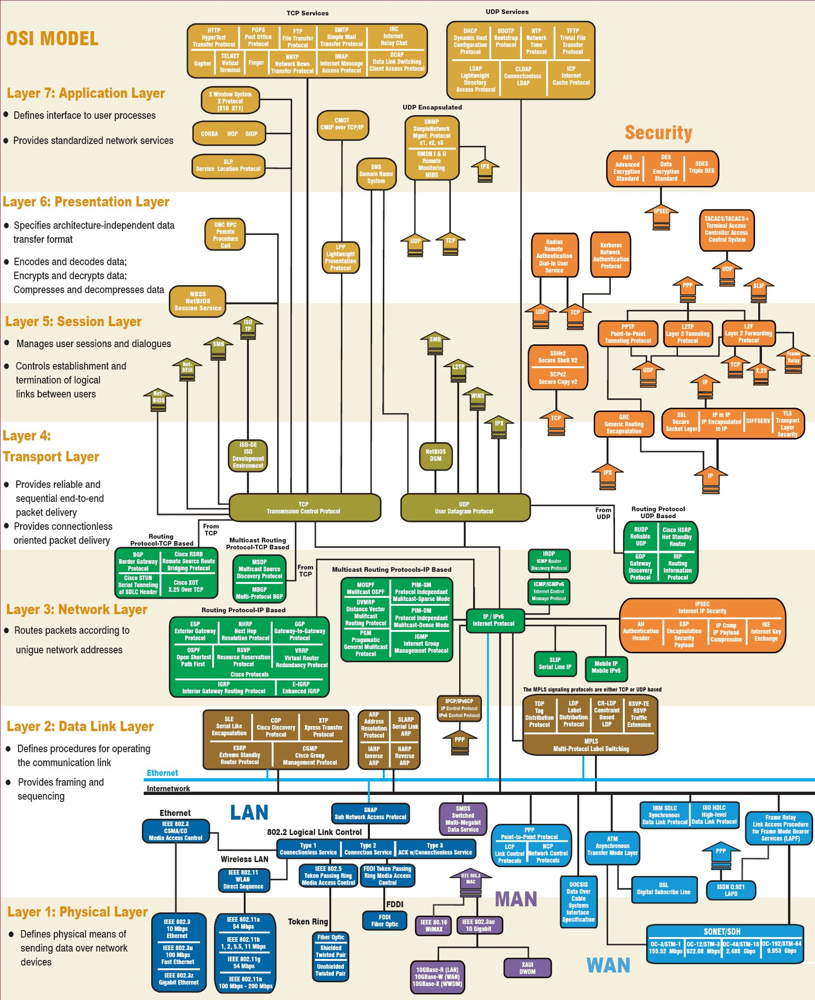

# network tips


[intro-to-iproute2](../../word-salad/cheatsheets/network-tips/intro-to-iproute2/)


* [configuration-with-iproute2.md](../../word-salad/cheatsheets/network-tips/intro-to-iproute2/configuration-with-iproute2.md "mention")
* [debugging-network-configuration-problems.md](../../word-salad/cheatsheets/network-tips/intro-to-iproute2/debugging-network-configuration-problems.md "mention")
* [persistent-network-configuration.md](../../word-salad/cheatsheets/network-tips/intro-to-iproute2/persistent-network-configuration.md "mention")
* [configure-client-side-dns.md](../../word-salad/cheatsheets/network-tips/intro-to-iproute2/configure-client-side-dns.md "mention")


[comparison-of-ipv4-and-ipv6.md](../../word-salad/cheatsheets/network-tips/comparison-of-ipv4-and-ipv6.md)


<figure><figcaption></figcaption></figure>

[https://developer.ibm.com/tutorials/l-lpic1-map/#exam-102-topic-109-networking-fundamentals11](https://developer.ibm.com/tutorials/l-lpic1-map/#exam-102-topic-109-networking-fundamentals11)
