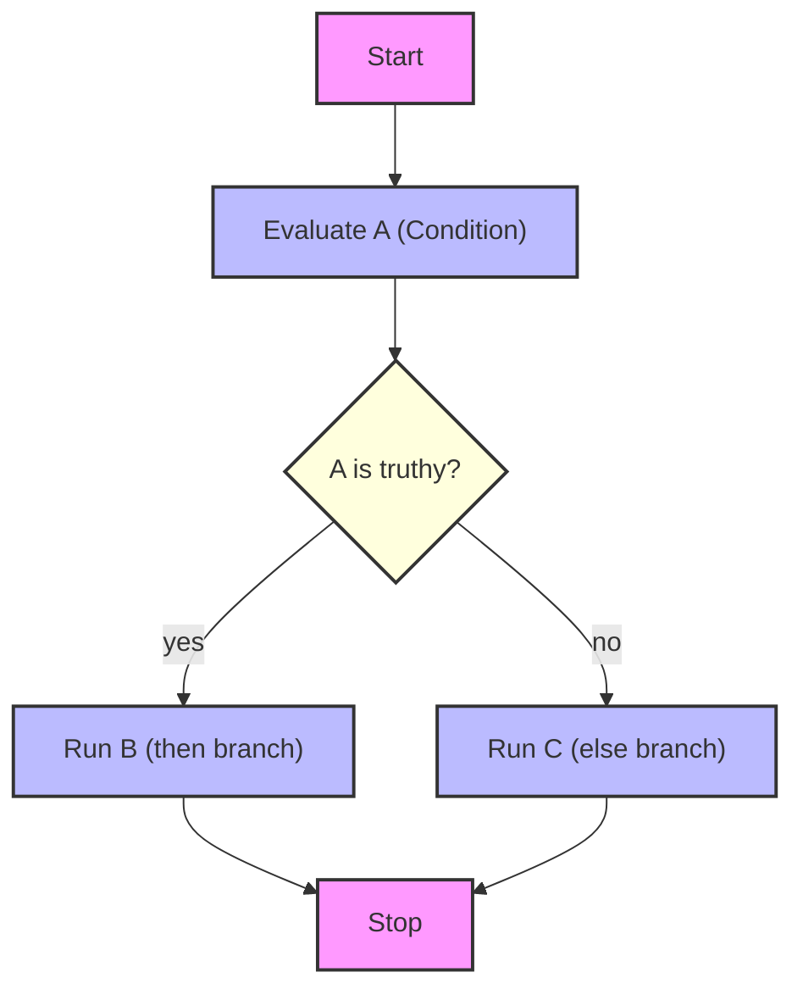

# jq


There is much more about this peculiar programming language that I cannot seem to wrap my head around. Writing out the parts I don't initially get and diagramming excessively seem to aid


## Conditionals and Comparisons

### The `if-then-else-end` conditional expression&#x20;

> to start, think of it like a basic coniditional in any other programming language ...

```jq
if (CONDITION) then (WHAT_TO_DO_IF_TRUE) else (WHAT_TO_DO_IF_FALSE_OR_NULL) end
```

#### The Rules of `jq`'s `if` :

* `CONDITION` is `truthy`⇒ run the `then` branch.
* `CONDITION` is `false` or `null` ⇒ run the `else` branch.
* No `else` is provided ⇒ defaults to outputting the current value `.`&#x20;

#### What is considered `truthy`  / `falsy` in `jq`?

* `truthy` : any value that is not `false` or `null`
* `falsy` : exactly `false` or `null` .


```jq
echo '""' | jq 'if . then "true" else "false" end'              # Outputs: "true"
echo '""' | jq 'if. == "" then "empty" else "not empty" end'    # Outputs: "empty"
```


### More examples until it sticks:


```jq
echo '2' | jq 'if . == 0 then "zero" elif . == 1 then "one" else "many" end'
```


* input: `2`
* output: `"many"`&#x20;

***


```jq
echo '{}' | jq 'if .name then "has name" else "no name" end'
```


* output: `"no name"`
  * because `.name` doesn't exist ⇒ `null` ⇒ `falsy`&#x20;

***


```jq
echo '{"name":""}' | jq 'if .name == "" then "empty" else "not empty" end'
```


* output: `"empty"`

If you omit `== ""` thecheck would pass, because `""` is truthy in `jq`&#x20;


```jq
echo '{"name":""}' | jq 'if .name then "truthy" else "falsey" end'
```


* output: `"truthy"`&#x20;

***

### why was Mark confused?

* he has a smooth brain
* `jq`'s truthiness is simpler than Python or Javascript: only `false` and `null` are falsy. Everything else is truthy:
  * numbers
  * empty strings
  * empty arrays
  * empty objects


```jq
echo '0' | jq 'if . then "truthy" else "falsey" end'   # truthy
echo '[]' | jq 'if . then "truthy" else "falsey" end'  # truthy
echo '{}' | jq 'if . then "truthy" else "falsey" end'  # truthy
```


***

| condition       | jq truthyness | notes                                  |
| --------------- | ------------- | -------------------------------------- |
| `null`          | falsy         | runs `else`                            |
| `false`         | falsy         | runs `else`                            |
| `0`             | truthy        | unlike python                          |
| `""`            | truthy        | unlike python                          |
| `[]`            | truthy        | unlike python                          |
| `{}`            | truthy        | unlike python                          |
| non-empty value | truthy        | always truthy unless `false` or `null` |

***

### how bout more examples


```jq
echo '{"name": "Mark"}' | jq 'if .name then "yes" else "no" end'
# Output: "yes"

echo '{}' | jq 'if .name then "yes" else "no" end'
# Output: "no"
```



```jq
echo '{"name": ""}' | jq 'if .name == "" then "empty" else "not empty" end'
# Output: "empty"
```



```jq
echo '0' | jq 'if . == 0 then "zero" else "not zero" end'
# Output: "zero"

echo '0' | jq 'if . then "truthy" else "falsey" end'
# Output: "truthy"
```



```jq
echo '[]' | jq 'if . then "truthy" else "falsey" end'
# Output: "truthy"

echo '{}' | jq 'if . then "truthy" else "falsey" end'
# Output: "truthy"
```


#### Multi-branch with `elif`


```jq
echo '2' | jq 'if . == 0 then "zero" elif . == 1 then "one" else "many" end'
# Output: "many"
```



