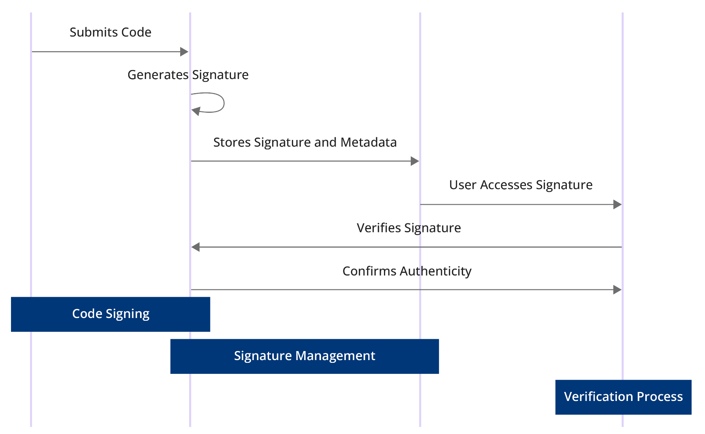

# Trunk two switches using 802.1q VLANS

Scenario: You have one MikroTik RB250GS switch running 802.1Q vlans and you want to extend all or some of those vlans to a second switch. The following diagram borrowed from a post by Ozelo explains:

\

The configuration of the first switch (192.168.88.1) is explained in a previous example [802.1Q Router on a Stick Example ](https://support.ispsupplies.com/knowledge/articles/115009794048). The main change to that example is the configuration of port ether5 since we want it to pass all the vlans to the second switch. The two pales you need to make changes are the VLAN tab and the VLANs tab. Confusing, yes but note the "s" on VLAN on one tab.

Configure the first switch as follows:

.png>)

\
.png>)

and the second:

<figure><figcaption></figcaption></figure>

<figure><figcaption></figcaption></figure>
