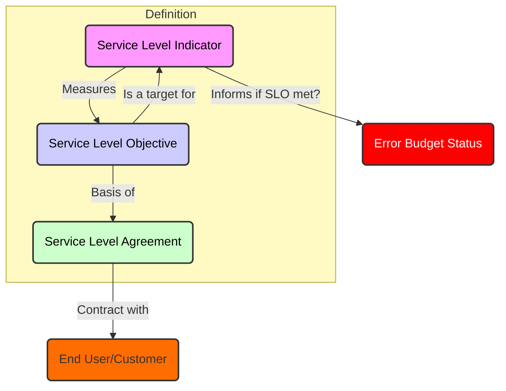
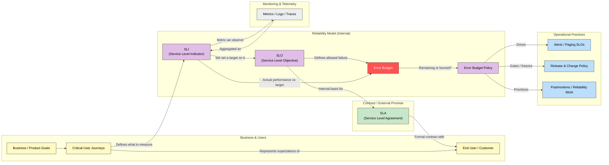

# Observability

## Learning Objectives

## Learning Objectives

By the end of this chapter, you should be able to:

* Explain why observability is important
* Discuss the benefits and downsides of different observability signals
* Identify example implementations for monitoring observability signals
* Explain how Prometheus fits into the observability landscape

### IT Systems Landscape

From small companies to large corporations, most organizations depend on IT systems, consisting of software, infrastructure, and services for their daily business. This is true whether a company is in the IT sector itself or not.

As a consequence of IT systems becoming a vital part of many businesses, it is becoming increasingly important to ensure that these systems work reliably and as expected.

## IT Systems Health

Whenever an IT system is vital for the fulfillment of business operations (or some other endeavor), you will want to ensure that the system's behavior is:

* Reliable
* Fast
* Efficient
* Correct

**However, the reality is that systems can be brittle,complex, and hard to understand and maintain**. Modern cloud computing, microservice application architecture, and distributed systems come with additional benefits and challenges. Modern applications are often designed to be more resilient, better performant, and more secure but require more visibility into the health of logical (software) and physical (infrastructure) layers. Partial failures are the norm, rather than the exception, in large, distributed systems. Even if the system as a whole is still performing its job, it might be in a partially degraded state where it works inefficiently or is about to fail completely.

### Traditional Monitoring: Check-Based Fault Detection

Check-based fault detection is a type of monitoring in which the monitoring system executes periodic check scripts on hosts to ensure that the hosts and services running on them are currently up, running, and healthy (for example: is the Apache web server process running?). When a check fails, the monitoring system sends a notification to an operator who then takes action. The most well-known example of a check-based monitoring system is [Nagios](https://www.nagios.org/), which presents its view of the current health of a host and its services like this:

<figure><figcaption><p><strong>Nagios Host Check View - Screenshot</strong></p></figcaption></figure>

In these check-based monitoring tools, there is usually little emphasis on historical data or basing fault detection on a unified, aggregated, or otherwise flexibly-derived view of an entire system or service over time and across machines. Instead, they mostly focus on reporting only the current and local health of components. Check-based tools also fall into the category of **black-box monitoring software**, since they probe a service from the outside rather than gathering detailed instrumentation from inside a service. Thus, the level of insight they can provide is limited.

Check-based tools like Nagios were originally built to monitor relatively static computing environments, in which machines had a designated purpose (database server, web server, proxy server, etc.) and where the overall topology changed infrequently. Because of their limited abilities and often static configuration, they break down in modern dynamic computing environments, especially when cluster orchestrators like Kubernetes come into play. Besides not coping well with the dynamic nature of such environments, check-based systems also don't provide deep enough insight into the health of the components they monitor to formulate the most precise and actionable alerts.

### What is Observability

Lately, the term "observability" has sprung up in the IT world. It generally refers to the measurable outputs a system provides to help understand and respond to its behavior. Systems need to be designed and built with mechanisms that make them observable, which often requires additional automation or instrumentation of the infrastructure or code.

Observability data is collected and used to predict and detect faults that could impede business operations, providing continuous insight into the health of systems and their environments. When faults are detected, this data can also trigger alerts for individuals or automated remediation systems.. Observability software, such as Prometheus, helps you do both. In addition to detecting faults, these tools help analyze overall system performance, which can lead to operational improvements.

### Observability Signals

> There are several methods to gather insight into your systems, sometimes referred to as the “pillars of observability”.

The CNCF's Technical Advisory Group for Observability defines these methods as "signals"; the term "pillars" implies they are foundational. Some of these methods may compete with each other, while others can work together. It's also important to note that they do not all need to be used simultaneously.

#### Signals of Continuous Systems Observability:

1. Log/Event-Based Monitoring
2. Metrics-Based Monitoring
3. Request Tracing

There are also other mechanisms for gaining insight into systems that an operator usually only activates on an ad-hoc basis, since running them all the time would be too expensive or disruptive to the running system.

Examples:

* Attaching a debugger to a process
* Profiling a program
* Tracing the full execution details or system calls of a process

These mechanisms do not typically play a part in online observability monitoring, but can be vital in uncovering the underlying cause of a problem once it has been detected.

<table data-card-size="large" data-view="cards" data-full-width="true"><thead><tr><th align="center"></th><th></th><th></th><th></th><th></th><th></th><th data-hidden data-card-cover data-type="image">Cover image</th></tr></thead><tbody><tr><td align="center"><h3><strong>Log/Event-Based Monitoring</strong></h3></td><td>Log- or event-based monitoring means collecting detailed information about all relevant events (e.g. all processed HTTP requests) that happen in a system and processing them either for general insight or for alerting. Examples:</td><td><ul><li>Apache web server logs all requests it processes into a file, and say we want to detect the longest running requests</li></ul></td><td>log-based monitoring involves processing pipelines that ship and transform logs or structured events to a central log-storage system such as:<br><a href="https://www.elastic.co/products/elasticsearch">Elasticsearch</a><br><a href="https://opensearch.org/">OpenSearch</a><br><a href="https://grafana.com/oss/loki/">Grafana Loki</a></td><td>display derived information like request rates or latencies in dashboards such as <a href="https://www.elastic.co/products/kibana">Kibana</a>, <a href="https://opensearch.org/docs/latest/about/">OpenSearchDashboards</a>, or <a href="https://grafana.com/oss/grafana/">Grafana</a> and base automated alerts on the collected event data.</td><td></td><td data-object-fit="contain"><a href="https://d36ai2hkxl16us.cloudfront.net/course-uploads/e0df7fbf-a057-42af-8a1f-590912be5460/ry4rvxovcclq-Apachewebserverlogs.png">https://d36ai2hkxl16us.cloudfront.net/course-uploads/e0df7fbf-a057-42af-8a1f-590912be5460/ry4rvxovcclq-Apachewebserverlogs.png</a></td></tr><tr><td align="center"><h3><strong>Metrics-Based Monitoring</strong></h3></td><td>Metrics-based monitoring periodically samples the current numeric value of an evolving measurement (such as the current memory usage or the total number of handled HTTP requests for every URL path) and appends the resulting sample to a time series database. You can then display the collected historical information in dashboards like <a href="https://grafana.com/oss/grafana/">Grafana</a> and define alerts on it.</td><td>The difference to log-based monitoring is that metrics lose per-event granularity and only represent pre-aggregated numeric data. For example, in the case of HTTP requests, metrics do not record all fields (e.g. client IP address, path, HTTP method, request duration) for every individual request, but only count the total number of requests handled so far.</td><td>Still, modern time series databases allow you to split up those counts by common low-cardinality fields (called "dimensions" or "labels"), like the HTTP method or the response status code, and thus, allow you to retain some level of detail.​</td><td>Especially in high-traffic environments, metrics can be orders of magnitude cheaper than logs to collect, store, and process. While losing per-event granularity, they still provide a great level of insight into overall system health. Alerts based on centrally-collected metrics can take into account the history and different levels of aggregation of time series from multiple sources. Thus, they make for a great source of actionable and precise alerts. It's often a good idea to base your main monitoring on metrics for this reason.</td><td><a href="https://prometheus.io/"><mark style="color:orange;"><strong>Prometheus</strong></mark></a> <mark style="color:orange;">is one example of a metrics-based monitoring system that allows efficient collection and flexible processing of time series data. Other examples of systems that can store metrics are</mark> <a href="https://www.influxdata.com/"><mark style="color:orange;">InfluxDB</mark></a><mark style="color:orange;">,</mark> <a href="http://opentsdb.net/"><mark style="color:orange;">OpenTSDB</mark></a><mark style="color:orange;">, and</mark> <a href="https://graphiteapp.org/"><mark style="color:orange;">Graphite</mark></a><mark style="color:orange;">.</mark></td><td><a href="https://d36ai2hkxl16us.cloudfront.net/course-uploads/e0df7fbf-a057-42af-8a1f-590912be5460/xbos6hjoq427-Prometheustime-seriesdataasdisplayedinGrafana.png">https://d36ai2hkxl16us.cloudfront.net/course-uploads/e0df7fbf-a057-42af-8a1f-590912be5460/xbos6hjoq427-Prometheustime-seriesdataasdisplayedinGrafana.png</a></td></tr><tr><td align="center"><h3><strong>Request Tracing</strong></h3></td><td>Request tracing is a special form of event logging that focuses on tracing individual requests across processing stages or service boundaries. For example, in a multi-tier architecture, request tracing might record how much time a given request has spent in the load balancer, in the web application server, and in the database layer. It may also record in which layer the request encountered a failure. Examples of request tracing systems are <a href="https://zipkin.io/">Zipkin</a>, <a href="https://www.jaegertracing.io/">Jaeger</a>, and <a href="https://grafana.com/oss/tempo/">Grafana Tempo</a>.</td><td>To make tracing work, every processing stage or microservice emits an event (called a "span") with details about its own phase of the processing, and stores those events in a central store. That store then correlates events for the same request using a common trace identifier. To avoid the cost problem of event logging, tracing usually only records information for a small sampled subset of all requests.</td><td>Request tracing provides deep insight into the overall lifecycle of a request and is especially helpful in determining which processing stages or sub-services can benefit most from optimizations. The main downside is that request tracing only works when all components cooperate in recording trace spans and passing on trace identifiers for a request to the next stage. Otherwise, correlation across service boundaries becomes impossible. <mark style="background-color:$warning;">Thus, it's often hard to make tracing work in all environments, and due to its specialized nature, it's not a great fit for basing your primary systems and service monitoring on it.</mark></td><td></td><td></td><td><a href="https://d36ai2hkxl16us.cloudfront.net/course-uploads/e0df7fbf-a057-42af-8a1f-590912be5460/gsi48myzmf4s-ThetraceofanHTTPrequestasdisplayedinJaeger.png">https://d36ai2hkxl16us.cloudfront.net/course-uploads/e0df7fbf-a057-42af-8a1f-590912be5460/gsi48myzmf4s-ThetraceofanHTTPrequestasdisplayedinJaeger.png</a></td></tr></tbody></table>

## Parameters to Monitor

To ensure the healthy operation of a system or service, you need to monitor its core system parameters.

Some examples of parameters that you might want to measure in cloud native systems and services are:

* The rate of incoming web requests
* The latency with which requests are handled
* The rate of request handling errors
* The usage and saturation of resources (like disks, queues, memory, or CPU cores)
* Tempeature, humidity, etc.

#### RED



The community collectively refers to these as RED (Rate, Errors, Duration) and USE (Utilization, Saturation, Errors) monitoring methodologies. A third methodology, known as the “Four Golden Signals”, has gained popularity in the community and includes latency, traffic, errors, and saturation. Together, these parameters offer a high-level overview of system health. When one of these parameters is behaving unexpectedly, you may decide to automatically alert a person or take auto-remedial actions.

```
The Four Golden Signals:
Latency
Errors
Traffic
Saturation
```



<figure><figcaption></figcaption></figure>



### Implementing Service Levels

Service levels measure the quality of IT systems and customer satisfaction through observability software. Additionally, service levels define system health in a common, non-technical language used between organizational business units.

Defining service levels enables organizations to prioritize the allocation of limited engineering resources and effort to maintain business critical systems first, high criticality systems second, and so on.

Service levels consist of the following:



Service Level Indicator (SLI) is a quantitative measurement of a system or service (e.g. latency or error rate).



Service Level Objective (SLO) defines criteria for acceptance or failure for a target value or range of SLI values.



Service Level Agreement (SLA) is a business contract that defines consequences for violating an SLO.








